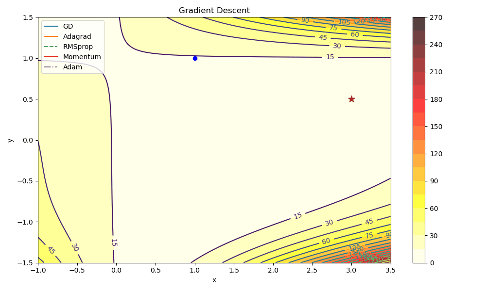

# statistical-principles-deep-learning
 Notes and codes for the book "Statistical principles of Deep Learning" to be published by Phillip YAM from CUHK.

#### Gradient Descent Visualization with GD, AdaGrad, RMSprop, Momentum, and Adam

