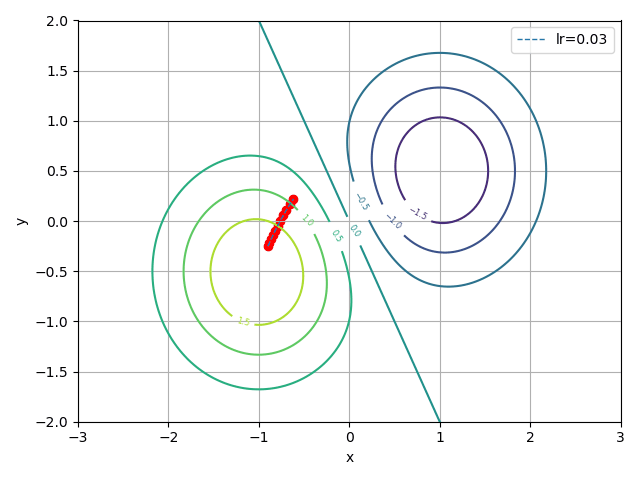

# statistical-principles-deep-learning
Notes and codes for the book "Statistical principles of Deep Learning" to be published by Phillip YAM from CUHK.

### Gradient Descent Dynamics Visualization

#### Comparison: Full-Batch Gradient Descent, AdaGrad, RMSprop, Momentum, and Adam

#### Stochastic Gradient Descent vs Mini-batch Stochastic Gradient Descent

#### Full-Batch Gradient Descent in 2D Space

#### Full-Batch Gradient Descent in 3D Space

