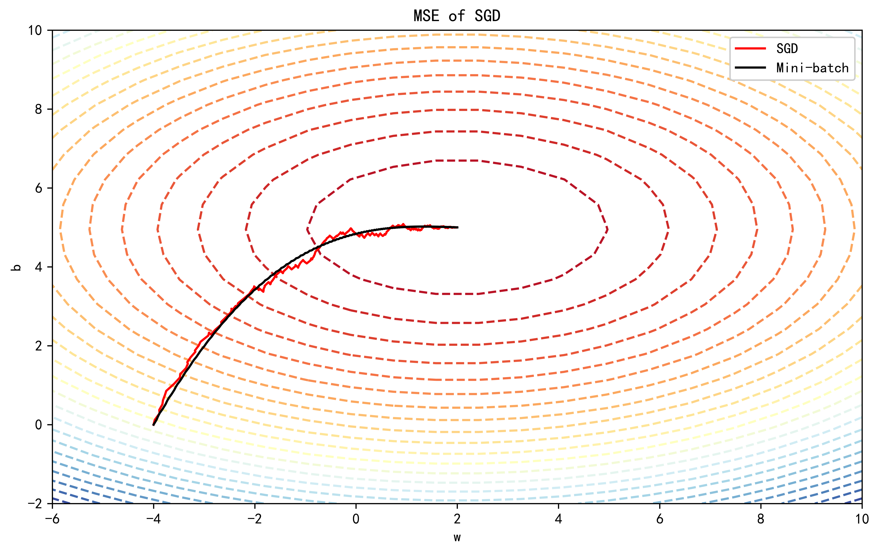

## Gradient Descent Visualization
Simple scripts using matplotlib and imageio to visualize the training dynamics with full-batch gradient descent, stochastic gradient descent, Adaptive Gradient Descent, Root Mean Square Propagation, Momentum, and adaptive moment estimation. 

Other classical optimizers can be self-defined, added and compared together.

#### Comparison: Full-Batch GD, AdaGrad, RMSprop, Momentum, and Adam

#### SGD vs Mini-batch SGD

#### Full-Batch GD in 2D Space

#### Full-Batch GD in 3D Space

